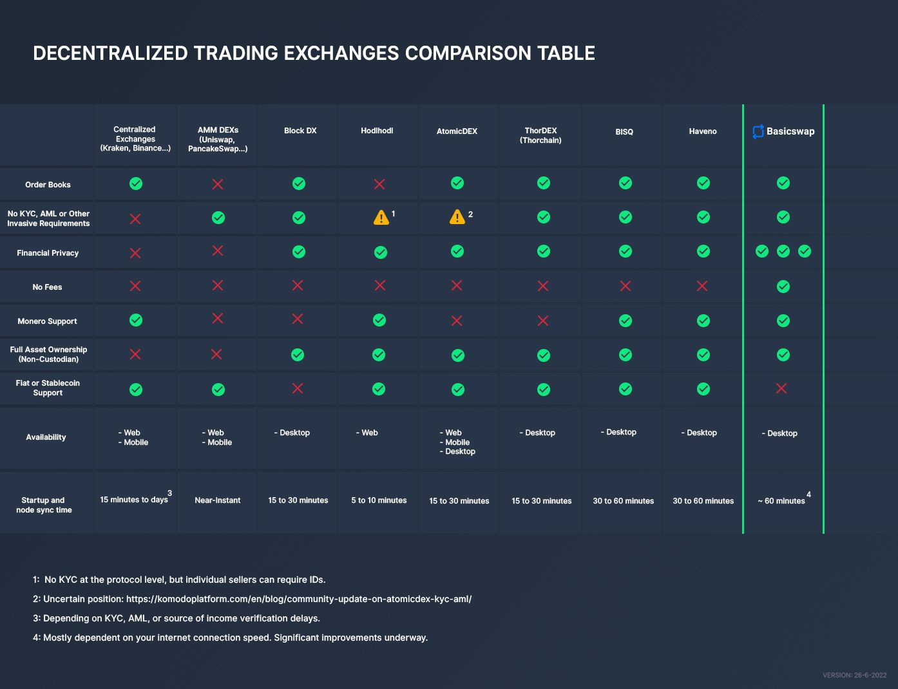

==============
DEX Comparison
==============
 
.. title::
     BasicSwap DEX Compared

.. meta::
      :description lang=en: See how BasicSwap DEX compares to other cryptocurrency trading exchanges.

BasicSwap is not the first :term:`DEX <DEX>` to see the day, but it certainly holds a unique position for itself, notably in relation to its strong commitments to security, :term:`decentralization <Decentralized Network>`, and privacy. Let’s take a look at how it compares to other popular DEXs available today.

----

    Comparison of the most popular DEXs (26-06-2022)

To get a better idea of how BasicSwap :term:`DEX <DEX>` compares to other cryptocurrency trading exchanges, you can first take a look at the following comparison chart.

.. container:: toggle

     .. container:: header

        **Order Books**

     An order book is an aggregated and public list of offers put by other traders. It is possible to either place an offer on the books, at the desired price, or take one already listed by another trader.

     Typically, order books require a central database to host the data. It is also often used to determine trading fees, with a different fee model being proposed for "makers" and "takers".

     Because BasicSwap is entirely decentralized, its order book is powered by the open-source SMSG network, as opposed to databases, and charges no fee at all.

.. container:: toggle

     .. container:: header

        **No Account**

     Exchanges, both centralized and decentralized, often require the creation of an account which increases friction as well as the risk of personal information and data leaks or misuse.

     BasicSwap doesn’t require accounts, and its non-custodial architecture ensures that you remain in control of your funds at all times.

.. container:: toggle

     .. container:: header

        **Financial Privacy**

     When you trade cryptocurrencies on an exchange, all of your financial data and activities are logged by the exchange operator and may be analyzed, shared with unauthorized parties, sold, or even leaked. 
     Additionally, depositing coins on an exchange reveals your wallet address, allowing that exchange to track and analyze all your previous transactions, as well as your current holdings, and share that information with their partners, which introduce significant security risks. 

     On BasicSwap, the security of your data and financial information is protected via its privacy-conscious technology stack. When making adaptor signatured-based atomic swaps, no revealing data is inscribed publicly, ensuring that none of your financial information is revealed to the public or unauthorized organizations without your consent.

.. container:: toggle

     .. container:: header

        **No Fees**

     Trading fees are a highly inconvenient fact one has to deal with when trading cryptocurrencies. They make trading often costly and eats on profits. At times, exchanges will have different fees for makers than for takers.

     That’s not the case with BasicSwap. The DEX functions free of charge; the only fee you need to pay when swapping is the usual on-chain cryptocurrency transaction fee of the coin you’re sending to the other swapper; a small price to pay for true cross-chain swaps, especially compared to the large trading fees one has to pay if trading on other exchanges (including the vast majority of decentralized ones).

.. container:: toggle

     .. container:: header

        **Monero Support**

     Monero is dubbed the king of privacy coins, and it’s certainly the one with the largest level of adoption. However, its highly-secure but rigid codebase makes it complicated to add the cryptocurrency to decentralized exchanges without adding third-party services or intermediary layer, which inevitably introduce central points of failure.

     BasicSwap offers a permanent and easy-to-use solution to that problem by allowing Monero to be swapped against a large number of cryptocurrencies, including Bitcoin, using adaptor signature-based atomic swaps.

.. container:: toggle

     .. container:: header

        **Non-Custodianship**

     “Not your keys, not your coins”. You’ve probably heard this often already, but it’s a major tenet of cryptocurrencies. When you deposit coins on an exchange, you essentially lose ownership of your coins with a promise that a third-party will grant you back ownership rights once you withdraw. This practice has led to an enormous number of funds theft or losses, either via malpractice from the third-parties in questions, or hacks/exploits of their platforms. Throughout the years, billions in value have been lost that way.

     BasicSwap flips the script by allowing you to remain in full control, at all times, of your private keys. Here, there is no third-party custodian; you are the full owner of your coins at every step of the way. To improve security even more, BasicSwap uses the official and publicly available core wallets of the coins available on the platform as wallets.

     Even when trading, BasicSwap uses a combination of the SMSG network, atomic swaps, and adaptor signatures instead of a central custodian to swap cryptocurrencies. 

.. container:: toggle

     .. container:: header

        **Fiat or Stablecoin Support**

     Being able to trade cryptocurrencies against more stable forms of currencies is a vital capability of exchanges. That’s because traders may want to hedge against the often-wild fluctuations of cryptocurrencies and, eventually, withdraw the fiat equivalent of their holdings.

     Unfortunately, BasicSwap does not currently support any stablecoin. It is, however, fair to expect the community to eventually integrate stablecoins in one form or another in the future.

.. container:: toggle

     .. container:: header

        **Accessibility**

     Availability or accessibility refers to how one interacts with an exchange. With most traditional exchanges, they can simply be accessed through the web by navigating to their URL. Some exchanges also offer mobile platforms. While this is incredibly helpful in terms of accessibility, it introduces several central points of failure and reduces the level of decentralization.

     BasicSwap, on the other hand, is only available via a local desktop client that has to be manually compiled by the user and run locally. This offers the maximum level of security, decentralization, and privacy, ensuring that your funds are as safe as possible.

.. container:: toggle

     .. container:: header

        **Set up Process**

     Traditional exchanges have their share of challenges when first setting up an account. However, most traders have grown accustomed to these practices.

     BasicSwap, like most other DEX, requires a more involved process in setting things up. In the case of BasicSwap, a full :term:`node <node>` of all enabled coins must be synced locally and the local client has to be manually compiled from the source code in the first place. This makes for a longer and, in some cases, more complicated setup process.

     However, this offers the maximum level of security, decentralization, and privacy, ensuring that your funds are as safe as possible.

----

.. seealso::
 
 - Blog Post - `BasicSwap The Fully Private Cross Chain DEX <https://particl.news/basicswap-the-fully-private-cross-chain-dex/>`_ 
 - Github - `BasicSwap <https://github.com/tecnovert/basicswap>`_
 - BasicSwap Explained - :doc:`DEX Comparison <../basicswap-dex/basicswap_compared>`
 - BasicSwap Explained - :doc:`Under the Hood <../basicswap-dex/basicswap_technicals>`
 - BasicSwap Guides - :doc:`Install and Get Started <../basicswap-guides/basicswapguides_installation>`
 - BasicSwap Guides - :doc:`Add or Remove a Coin <../basicswap-guides/basicswapguides_installation>`
 - BasicSwap Guides - :doc:`Integrate a Coin <../basicswap-guides/basicswapguides_apply>` 
