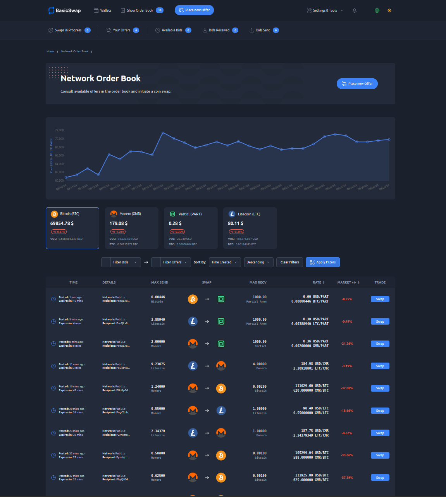
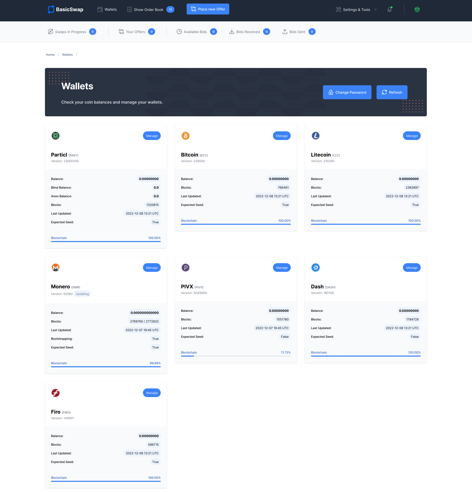

===================
BasicSwap Explained
===================
 
.. title::
     BasicSwap DEX Explained

.. meta::
      
      :description lang=en: Overview of the BasicSwap DEX protocol and its local desktop client.
 
:term:`BasicSwap <BasicSwap>` is a cross-chain and privacy-centric :term:`DEX <DEX>` (decentralized exchange) that lets you trade cryptocurrencies without middleman interference. Its distributed order book lets you make or take orders at no cost and trade within a free and open environment without central points of failure.

BasicSwap was built in direct response to the increasingly invasive demands and data mining practices of today’s :term:`cryptocurrency` exchanges. It strives to bring more sane cryptocurrency trading conditions for all.

----
 
.. contents:: Table of Contents
   :local:
   :backlinks: none
   :depth: 2
 
----

What is it?
^^^^^^^^^^^

    BasicSwap's order book — WIP/Beta, UI/UX subject to change

While the :term:`BasicSwap` DEX is easy-to-use and relatively straightforward, what happens in the background is complex and intricate. 

The protocol leverages a variety of distributed and open-source technologies such as atomic swaps, scriptless scripts, and the SMSG network. This enables it to run autonomously without central servers, databases, or even employees maintaining it. Rather, the protocol is developed, maintained, and run by a vast decentralized network of contributors and participants from all around the world.

Benefits
---------

This decentralized architecture gives :term:`BasicSwap` major advantages when compared to traditional exchanges (sometimes referred to as “centralized exchanges” or “CEX”).

* **No trading fees** — you never have to pay trading fees ever again.
* **Total privacy** — no data or personal information is ever collected about you.
* **Secure** — its non-custodial approach offers the highest level of security for your funds.
* **No KYC or account** — you don’t have to create an account or provide any document or KYC information.
* **Complete freedom** — no user ban, geo-fencing, or asset seizures.
* **Unstoppable** — can’t be censored or shut down by anyone.
* **Autonomous** — runs by itself and requires no human intervention.

These advantages are only possible thanks to the uniquely :term:`decentralized <Decentralization>` nature of the BasicSwap protocol.

Features
--------

BasicSwap is still in beta. That means that, while it offers most of the basic trading features you’d expect to see on centralized exchanges, it is still in heavy development, and many more features will come about in the near future.

* **True cross-chain support** — Swap cryptocurrencies that live on different blockchains like Bitcoin and Monero.
* **Distributed order book** — Make or take limit orders on a completely distributed order book system.
* **No third-party or middleman** — Trade crypto with no intermediaries whatsoever.
* **No trading fees** — Only pay the typical :term:`cryptocurrency` network fee. No more trading fees!
* **Privacy from the ground up** — Every component of BasicSwap is built with a privacy-first commitment.
* **Full Monero support** — Swap Monero with a variety of other cryptocurrencies like Bitcoin or Particl. No wrapped assets or trickery involved.
* **User-friendly interface** — Enjoy all these features with a user-friendly and intuitive interface that does all the complicated parts for you.

Compatible Coins
^^^^^^^^^^^^^^^^

    BasicSwap's wallets page — WIP/Beta, UI/UX subject to change

BasicSwap already offers decentralized trading services for the following cryptocurrencies (`check it out on BasicSwap website <https://basicswapdex.com/markets>`_).

+----------------------------------+---------------------------------------------+
| **Coin Name**                    | **Ticker**                                  |
+----------------------------------+---------------------------------------------+
| Bitcoin                          | BTC                                         |
+----------------------------------+---------------------------------------------+
| Monero                           | XMR                                         |
+----------------------------------+---------------------------------------------+
| Dash                             | DASH                                        |
+----------------------------------+---------------------------------------------+
| Litecoin                         | LTC                                         |
+----------------------------------+---------------------------------------------+
| Firo                             | FIRO                                        |
+----------------------------------+---------------------------------------------+
| PIVX                             | PIVX                                        |
+----------------------------------+---------------------------------------------+
| Particl                          | PART                                        |
+----------------------------------+---------------------------------------------+

We are looking at adding many other coins, including ETH and its ERC-20 tokens, following the release of the open beta. Any Bitcoin-based and Segwit-enabled :term:`cryptocurrency` can get integrated with minimal effort. Other token-issuing blockchains like Fantom, Solana, Avalanche, Polygon, or BSC may become available on BasicSwap at a later stage of the integration roadmap.

Access Gateways
^^^^^^^^^^^^^^^

Access gateways refer to any platform used by the end-user to access and use BasicSwap. It is, in other words, the graphical interface of the application.

Because BasicSwap is, at its core, an open DEX protocol, it is possible to access and use it with a variety of access gateways. 

Gateways, each with pros and cons, may display things differently or provide a different set of features. But because they each connect to the same protocol, all gateways are cross-compatible with each other and share the same order books and liquidity, meaning two swappers do not need to be using the same gateway to trade together.

.. container:: toggle

    .. container:: header

        **BasicSwap Desktop**

    BasicSwap Desktop is currently the only way to access and use the BasicSwap open beta, with other access gateways in the works. It not only lets you manage your various non-custodial :term:`cryptocurrency` wallets but also trade with other people without third-party interference. 

    **Pros:**

    * **No compromise** — Use BasicSwap without any central service involved.
    * **Desktop access** — Access the DEX locally from your computer.
    * **Maximum privacy** — Trade in complete and total privacy.

    **Cons:**

    * **Slower setup** — The local client needs to be manually compiled and the initial setup process can take some time and tinkering.
    * **No web access** — The DEX has to be accessed from a local client and cannot be used from the convenience of a web browser.    
    * **Must stay online** — Your BasicSwap :term:`node <node>` needs to remain online to keep your offer(s) listed on the order book and execute trades.
    * **Heavy** — You need to download and store the full blockchain nodes of the coins you’ve enabled, which can take a considerable amount of space.

.. container:: toggle

    .. container:: header

        **Web Gateway**

    Although not available presently, a web gateway that lets you access and use the marketplace from your favorite browser is in the works.

    With web applications taking an ever-increasing part of our digital lives and with the vast majority of exchanges being primarily available from the web, BasicSwap’s web gateways are poised to become one of the most appealing ways to trade on it.

    **Pros:**

    * **Universal access** — Use BasicSwap anywhere using your computer or mobile device.
    * **Faster to set up** — Get started in just a few seconds thanks to a much quicker setup process and no requirement to host full blockchain :term:`nodes <node>` locally.
    * **Easy to use** — Using the marketplace from the web is the easiest and most user-friendly way to go about it.

    **Cons:**

    * **Third-party nodes** — Third-party nodes slightly reduce the level of decentralization but still preserve your privacy and the security of your funds using end-to-end encryption and a non-custodial approach.
    * **Phishing** — By nature, web applications tend to be more prone to successful phishing, clones, and social engineering attacks.

.. container:: toggle

    .. container:: header

        **Third-Party Integrations**

    BasicSwap can communicate with outside applications, enabling integrations in third-party products and services like :term:`cryptocurrency` wallets, payment applications, web plugins, etc.

    But although this functionality is already available, a comprehensive developer SDK toolkit along with developer-friendly modules are in the works to make the process of integrating the marketplace into third-party applications easier and more straightforward. 

    **Pros:**

    * **Use-case improvement** — Add functionality and use-cases to your product by integrating the ready-made BasicSwap DEX.
    * **Varied access** — Access and use BasicSwap from other non-Particl applications that you may already use.
    * **All the benefits of web access** — Integrating the DEX into a third-party application can enable all the benefits of web gateways.

    **Cons:**

    * **Third-party nodes** — Third-party nodes slightly reduce the level of decentralization.
    * **Privacy risks** — A third-party may not hold the same privacy ethos as the Particl project and work on collecting data or tracking its users.
    * **Implementation risks** — Requires that you trust the third-party and its implementation of the Particl Marketplace.

----

.. seealso::
 
 - Blog Post - `BasicSwap The Fully Private Cross Chain DEX <https://particl.news/basicswap-the-fully-private-cross-chain-dex/>`_  
 - Github - `BasicSwap <https://github.com/tecnovert/basicswap>`_
 - BasicSwap Explained - :doc:`DEX Comparison <../basicswap-dex/basicswap_compared>`
 - BasicSwap Explained - :doc:`Under the Hood <../basicswap-dex/basicswap_technicals>`
 - BasicSwap Guides - :doc:`Install and Get Started <../basicswap-guides/basicswapguides_installation>`
 - BasicSwap Guides - :doc:`How to Use <../basicswap-guides/basicswapguides_usage>` 
 - BasicSwap Guides - :doc:`Add or Remove a Coin <../basicswap-guides/basicswapguides_installation>`
 - BasicSwap Guides - :doc:`Apply for Coin Listing <../basicswap-guides/basicswapguides_apply>`  