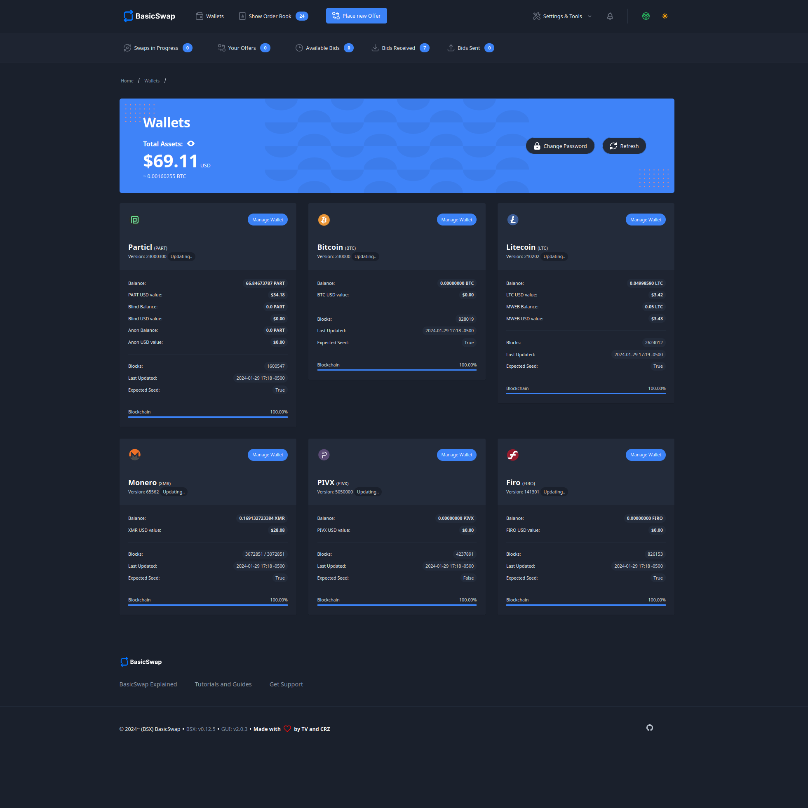

===================
BasicSwap Explained
===================
 
.. title::
     BasicSwap DEX Explained

.. meta::
      
      :description lang=en: Overview of the BasicSwap DEX protocol and its local desktop client.
 
:term:`BasicSwap <BasicSwap>` is a cross-chain and highly secure :term:`DEX <DEX>` (decentralized exchange) that lets you trade cryptocurrencies without middleman interference using atomic swaps. Its distributed ledger technology enables users to place or accept swap offers without fees, promoting a free and open trading environment devoid of central points of failure.

:term:`BasicSwap <BasicSwap>` is crafted to uphold the highest standards of freedom in direct opposition to the growing threats to our sovereignty in the digital age. 

----
 
.. contents:: Table of Contents
   :local:
   :backlinks: none
   :depth: 2
 
----

What is it?
^^^^^^^^^^^

    BasicSwap's order book — WIP/Beta, UI/UX subject to change

:term:`BasicSwap <BasicSwap>` is the world’s most secure and decentralized DEX. It facilitates cross-chain atomic swaps by enabling peers to interact directly with each other within a free and open environment without central points of failure.

This DEX is fully non-custodial and features a decentralized order book, letting you create or accept swap offers without any fees, counterparties, or the need for accounts.
Built as a low-friction, highly secure solution to the frequent losses of funds on centralized exchanges (e.g., FTX, BitFinex, MtGox), :term:`BasicSwap <BasicSwap>` aims to provide more reliable and secure cryptocurrency trading conditions for everyone.

:term:`BasicSwap <BasicSwap>` is currently in beta. While it already offers most of the essential trading features you'd expect from regular exchanges, it is still under development by community contributors, with many more features coming soon.

Benefits
---------

:term:`BasicSwap` distinguishes itself from conventional exchanges, often known as “centralized exchanges” or “CEX,” through its decentralized framework which offers several key advantages:

* **True cross-chain support** — Swap cryptocurrencies that live on entirely different blockchain environments, like Bitcoin and Monero.
* **Decentralized order book** — Make or take limit swap offers on a completely distributed order book system.
* **No third-party or middleman** — Trade crypto with no intermediaries, completely eliminating central points of failure.
* **No trading fees** — Only pay the typical cryptocurrency network fee.
* **Superior financial privacy** — Protect your financial information from unauthorized access with BasicSwap’s privacy-conscious technology.
* **Full Monero support** — Swap Monero with a variety of other cryptocurrencies like Bitcoin or Particl. No wrapped assets or layer-2 involved.
* **User-friendly interface** — Enjoy all these features within a user-friendly and intuitive interface that handles all the complicated parts for you.

These benefits stem directly from the inherently :term:`decentralized <Decentralization>` nature of the BasicSwap protocol and aren't possible on centralized infrastructure.

Under the Hood
--------

:term:`BasicSwap <BasicSwap>` can be best understood as the decentralized version of the SWIFT messaging network; it sends and receives messages between two peers via the decentralized SMSG network for them to execute coin swaps together without any central party involvement. 

The coin swapping process itself is not conducted by :term:`BasicSwap <BasicSwap>`. Instead, it is handled by on-chain atomic swaps on the respective blockchains of the cryptocurrencies being exchanged. :term:`BasicSwap <BasicSwap>`'s role is to enable communication between swappers, allowing them to exchange the necessary information for atomic swaps and to publicly broadcast their offers without intermediaries.

Get familiar with how BasicSwap works by consulting `this important definition page <https://basicswapdex.com/terms>`_.

Compatible Coins
^^^^^^^^^^^^^^^^

    BasicSwap's wallets page — WIP/Beta, UI/UX subject to change

+----------------------------------+---------------------------------------------+
| **Coin Name**                    | **Ticker**                                  |
+----------------------------------+---------------------------------------------+
| Bitcoin                          | BTC                                         |
+----------------------------------+---------------------------------------------+
| Monero                           | XMR                                         |
+----------------------------------+---------------------------------------------+
| Dash                             | DASH                                        |
+----------------------------------+---------------------------------------------+
| Litecoin                         | LTC                                         |
+----------------------------------+---------------------------------------------+
| Firo                             | FIRO                                        |
+----------------------------------+---------------------------------------------+
| PIVX                             | PIVX                                        |
+----------------------------------+---------------------------------------------+
| Decred                           | DCR                                         |
+----------------------------------+---------------------------------------------+
| Wownero                          | WOW                                         |
+----------------------------------+---------------------------------------------+
| Particl                          | PART                                        |
+----------------------------------+---------------------------------------------+

BasicSwap is completely open-source and community-powered, meaning that anyone can contribute by integrating assets. If you'd like to add a coin not currently available on the platform, head over to :doc:`this page <../basicswap-dex/basicswapguides_apply>` of the Particl Academy!

----

.. seealso::
 
 - Blog Post - `BasicSwap The Fully Private Cross Chain DEX <https://particl.news/basicswap-the-fully-private-cross-chain-dex/>`_  
 - Github - `BasicSwap <https://github.com/basicswap/basicswap>`_
 - BasicSwap Explained - :doc:`DEX Comparison <../basicswap-dex/basicswap_compared>`
 - BasicSwap Explained - :doc:`Under the Hood <../basicswap-dex/basicswap_technicals>`
 - BasicSwap Guides - :doc:`Install and Get Started <../basicswap-guides/basicswapguides_installation>`
 - BasicSwap Guides - :doc:`Add or Remove a Coin <../basicswap-guides/basicswapguides_installation>`
 - BasicSwap Guides - :doc:`Integrate a Coin <../basicswap-guides/basicswapguides_apply>`  
