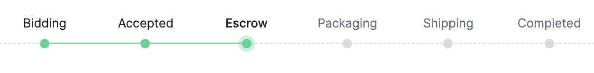

==================================
Particl Marketplace Brief Overview
==================================

.. meta::
   :description lang=en: Find out about key factors when using Particl Marketplace in a brief overview.

The :term:`Particl Marketplace` is your private and :term:`decentralized <Decentralization>` online marketplace to buy and sell anything online. Here, there is no marketplace company, e-commerce service provider, database, server, hosting service, payment processor, bank, and no other kind of third-party involved. Just pure and confidential person-to-person transactions between you and another person.

To unlock these benefits to you not possible before with traditional online marketplaces, there are just a few things you need to be aware of before you get started. It's very easy to use,  Let's go over them!

.. seealso::

	- Particl Academy - Introduction :ref:`Uncompromising, What You Get`
	- Particl Academy - Introduction :ref:`Target Audiences`
	- Particl Academy - Explained :ref:`Particl Marketplace <Particl Marketplace Explained>`

Don't Trust, Verify!
--------------------

By making the choice to use :term:`Particl Marketplace`, you give yourself all the tools you need to confidently stay ahead of the technological curve with industry-leading privacy technology.

You don't need to trust anyone; the code is open-source, independently audited, and freely available online for everyone to inspect. See for yourself!

.. seealso::

	- Github - Overview `Particl Repositories <https://github.com/particl>`_

----

General Usage and Concept
-------------------------

While using :term:`Particl Marketplace` you expect easy usability while making zero compromise on the core values of :term:`decentralization <Decentralization>`, security, privacy, and :term:`disintermediation <Disintermediation>` at the same time.

This is the essence that makes you stand out.

.. note::

	A web and a mobile version of :term:`Particl Marketplace` are planned to be released later on and will play a key role in making the platform more accessible and convenient to use.

.. seealso::

	- Particl Academy - Guide :ref:`User-Interface`
	- Particl Academy - Explained :ref:`Security and Privacy <Security and Privacy Explained>`

----

Payment Processing
------------------

To enable you with near-free, near-instant currency transactions that cannot be held up, blocked, reversed, or delayed by anyone, you are relying with :term:`Particl Marketplace` on digital currencies, commonly called :term:`cryptocurrencies <Cryptocurrency>`.

You can use an ever-growing list of digital currencies to make payments on the :term:`Particl Marketplace`. However, the final settlement of any payment is always made in “PART”, Particl’s own :term:`cryptocurrency <Cryptocurrency>`.

.. note::

	Payments with local, national currencies (i.e., USD, EUR) is planned to be integrated later on and will play a key role in making the platform even more accessible and convenient to use.

.. seealso::

	- Particl Academy - Explained :ref:`PART Coin <Currency (PART) Explained>`
	- Particl Academy - Explained :ref:`Settlement of Payments <Payments and settlement-layer>`

----

Fraud Protection
----------------

Regardless if you're a vendor or a customer, you equally hate falling victim to a scammer.

You want to prevent e-commerce fraud from happening at no extra cost and easy to setup for you. One of :term:`Particl Marketplace`'s unique selling propositions makes it a breeze for you to achieve that.

Any purchase you make is secured by a two-party escrow system that doesn’t require any third-party to be involved. 

.. seealso::

	- Particl Academy - Explained :ref:`Two-Party Escrow <Two-Party Escrow Explained>`

----

Phases of a Deal
----------------

Because you value security, privacy, and cost-effectiveness benefits, you are willing to do three additional steps to complete a purchase in full.

These three additional steps are the only compromises made over traditional marketplaces. Compare this tradeoff to your benefits. That’s a pretty sweet deal!

.. note::

	We are constantly improving the software and its user experience. Eventually, we also want to get rid of these extra steps.

.. seealso::

	- Particl Academy - Explained :ref:`A deal as a Step-by-Step Process <Step-by-Step Process>`
	- Particl Academy - Introduction :ref:`Target Audiences`

----

Community Markets
-----------------

Want to have your own shop or even launch an entire market? Do you want it to be publicly available or kept secret between a few individuals?

You deploy as many shops and markets as you wish, and you are in complete control of their data, level of privacy, and accessibility. And to put the icing on the cake, this comes at no extra cost for you.

Your use-cases for :term:`community markets <Community Market>` are versatile. They can be brand stores, markets for your online community, NFT markets, art galleries (bidding auctions), VIP or private stores, OTC desks, pop-up stores, and pretty much anything you can imagine. The possibilities are endless!

.. seealso::

	- Particl Academy - Guide :doc:`../guides/guide_mp_general_market_management`

----

Crowd Moderation
----------------

The “wisdom of the crowd” theory is your secret power when it comes to moderation of the :term:`Particl Marketplace`. Since you, everybody, and nobody owns the :term:`Particl Marketplace` every participant on the marketplace has the equal opportunity to flag and take off undesirable content. 

See something you think shouldn't be on the marketplace? Flag it! When enough people do the same, it will be taken off the marketplace.

.. seealso::

	- Particl Academy - Explained :ref:`Marketplace Moderation <Marketplace Moderation Explained>`

----

Work in Progress
----------------

:term:`Particl Project` is an ever-ongoing work in progress. Every day, it’s getting better, easier to use, and more accessible. Exciting new projects and features emerge to help the :term:`Particl ecosystem <Particl Ecosystem>` thrive constantly. So be a part of it–as a customer, vendor, promoter, developer, manager, or any other void you can fill with passion.

.. admonition:: Action

	Visit the blog `Particl News <https//particl.news/>`_, follow on `Twitter <https://twitter.com/particlproject>`_, `Reddit <https://reddit.com/r/particl>`_, or register to the newsletter to stay in the loop about what's coming next.

----

**Almost there**

Phew! You've made it this far! By now, you have quite a good understanding of the :term:`Particl Marketplace`. In the next section, you'll have a deeper look into all of its components. 

But perhaps you want to skip that part and install it right away? Then just head over to the :ref:`Installation Guides`.

----

