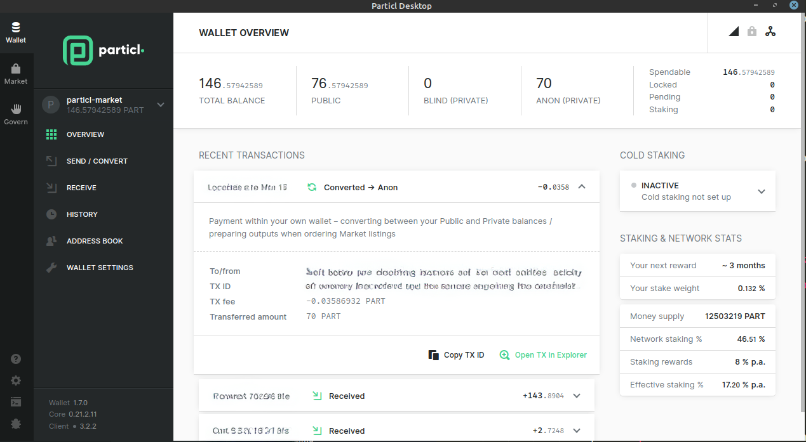

===============
Particl Desktop
===============

.. title::
   Particl Desktop Overview

.. meta::
   :description lang=en: Overview of the main functions of the Particl Desktop client. 

Particl Desktop is Particl’s main desktop client, and the preferred access gateway into the :term:`Particl ecosystem <Particl ecosystem>`. It enables access to some of the various privacy-first dApps, acts as the go-to PART wallet, and allows users to vote on and track DAO proposals. 

While Particl contributors are working on alternative gateways to access and interact with the Particl ecosystem and its privacy-first dApps (i.e., web, mobile), Particl Desktop is the most secure, private, and :term:`decentralized <Decentralized>` access point available.

.. contents:: Table of Contents
   :local:
   :backlinks: none
   :depth: 2

----

Wallet
------

    Particl Desktop's wallet overview page

Particl Desktop’s “wallet” section is where you can manage your funds and overview your financial activities. Particl Desktop also allows users to manage, create and import an infinite number of wallets within the same environment. All wallets are independently encrypted for maximum security.

.. container:: toggle

    .. container:: header

        **Send/Convert and Receive**

    - Send and receive funds and convert coins between the different available balance types.
    - Manage and organize UTXOs to optimize your transactions using the Coin Control feature.
    - Adjust the desired level of transactional transparency.
    - Split UTXOs into smaller chunks for better privacy.
    - Convert balances between the three types of available balances (public, blind, and anon).
    - Receive funds in public or private (stealth) addresses.

.. container:: toggle

    .. container:: header

        **History**

    - Keep track of all your previous transactions.
    - Outgoing transactions
    - Incoming transactions
    - Earned staking rewards
    - Balance type conversions

.. container:: toggle

    .. container:: header

        **Address Book (Contacts)**

    Because funds need to be sent to cryptographic addresses, it can be hard to remember who owns which address. Particl Desktop’s address book page is there specifically to let you label PART addresses to contacts.

    - Save both public and private PART addresses and enter their contact information.
    - Display a contact’s address and all of its details in a block explorer.
    - Sign and verify messages using PART addresses.
    - When sending funds to one of your contacts, you can quickly pick their address from the address book.

Market
------

The "Market" section of the :term:`Particl Desktop` client is the main access gateway for the Particl marketplace dApp. It allows you to browse items available on the market, manage your own inventory of products and listings, join additional markets and storefronts, and review your buy orders and sell orders. It is the first dApp to be integrated fully within the Particl Desktop client.

.. container:: toggle

    .. container:: header

        **Overview**

    - Access shortcuts that make your buyer or seller experience easier.
    - Monitor your funds and balances.

.. container:: toggle

    .. container:: header

        **Browse**

    - Browse online markets and storefronts.
    - Discovert products and services and add them to your cart.
    - Flag undesirable listings and see those others have flagged.
    - Sort marketplace content by categories, regions, and keywords.
    - Expand listing details and see more information about them.
    - Communicate with sellers and leave questions on their listings.

.. container:: toggle

    .. container:: header

        **Cart**

    - View your cart and the items you've added to it.
    - View the items you've saved for later.
    - Manage your shipping profiles.

.. container:: toggle

    .. container:: header

        **Purchases**

    - View your marketplace purchasing history.
    - Manage ongoing purchasing orders.
    - Communicate with your orders' sellers.

.. container:: toggle

    .. container:: header

        **Sell**

    - View your marketplace sales history.
    - Manage ongoing sales.
    - Communicate with your customers.
    - View and manage your marketplace listings.
    - List new products or services.
    - Import inventory from external source (i.e., WooCommerce).
    - Bulk adjust prices and other listing details.
    - Publish listings in one or more markets/storefronts at once.
    - Clone listings.

.. container:: toggle

    .. container:: header

        **Chat Messages**

    - View all your conversation history.
    - Continue discussions with other users.
    - Manage your contact list.

.. container:: toggle

    .. container:: header

        **Manage Markets**

    - Create a new market or storefront.
    - Join public markets using the Market Browser.
    - Join private markets manually using their keys.
    - Manage already-joined markets.
    - Flag undesirable markets and see those others have flagged.

Govern
------

.. figure:: ../_static/media/images/desktop_govern.png
    :align: center
    :alt: Particl Marketplace
    :target: ../_static/media/images/desktop_govern.png

    Particl Desktop's community governance section

The "Govern" section of the :term:`Particl Desktop` client is where community governance proposals can be displayed and voted on, in an intuitive and user-friendly interface. It also includes additional documentation on the Particl DAO's governance mechanisms.

.. seealso::

 * Particl Explained - :doc:`Blockchain Specifications <../particl-blockchain/blockchain_part_overview>`
 * Marketplace Explained - :doc:`Particl Marketplace Explained <../particl-marketplace/marketplace_explained>`
 * PART Guides - :doc:`Send, Receive, and Convert PART <../part-guides/partguides_sendreceiveconvert>`
 
 .. note:
    The Particl Desktop application is available for download on Particl's official website:
	
	 https://particl.io/downloads
