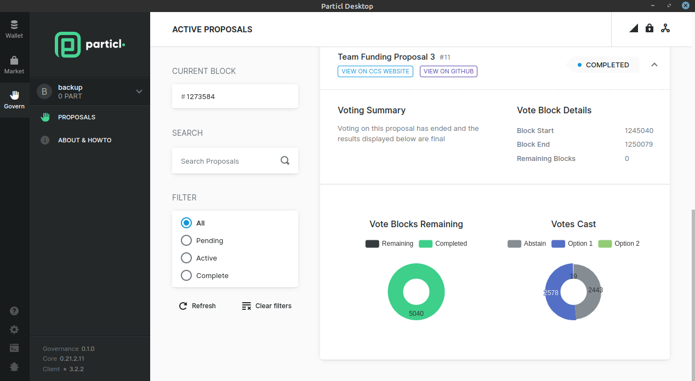

============
Voting Guide
============

.. title::
   Particl Voting Guide

.. meta::
   :description lang=en: Learn how to publish Particl DAO proposals and vote on-chain.

With Particl Proof-of-Stake, you can vote on various community proposals using your staking power as voting power. When you register your voting preferences during a proposal's voting period, you’ll cast a vote every time you find a block.

The more blocks you stake within a proposal's voting period, the more voting power you have.

    Particl Desktop's community governance section

-----

.. note:: 

    **Prerequisites**

    - A Particl node actively staking.
    - An active internet connection.

.. tabs::

     .. group-tab:: Partyman

         **Partyman Staking App**

         .. rst-class:: bignums

             #. Access your Partyman staking node and enter Partyman’s folder.

                 .. code-block:: bash

                     cd ~/partyman

             #. Make sure Partyman is on the latest version.

                 .. code-block:: bash

                     git pull

             #. Still in Partyman’s folder, find what proposal you want to vote for.

                 .. code-block:: bash
                     
                     ./partyman proposal list

             #. Vote on the proposal by typing the following command.

                 .. code-block:: bash
                     
                     ./partyman proposal vote

             #. Confirm that you want to vote for a proposal. This will clear all previous voting preferences if you’re already voting on a proposal.

             #. Enter the ID of the proposal you want to vote for and press :guilabel:`Enter`.

             #. Enter the voting option you want to cast your vote for and press :guilabel:`Enter`.

     .. group-tab:: Particl Desktop

         **Particl Desktop**

         .. rst-class:: bignums

             #. Open your :term:`Particl Desktop` client.

             #. Navigate to the :guilabel:`Govern` section.

             #. Check if there is an active proposal being voted on and click on its tile to expand its information.

             #. Review the detailed proposal by clicking on the :guilabel:`VIEW ON CCS WEBSITE` button.

             #. Select the option you want to vote for, and click on :guilabel:`Vote`.

             #. Confirm your voting preference in the pop-up window that appears.

             .. Important::

                 Your Particl Desktop wallet will need to remain open for the duration of the voting round. Every time it stakes a block, it will cast a vote in favor of your voting preference.

     .. group-tab:: Particl Qt

         **Particl Qt**

         .. rst-class:: bignums

             #. Open your Particl Qt client.

             #. Find what proposal you want to vote for by visiting the `CCS platform <https://ccs.particl.io/>`_. Note the ID of the proposal and the block numbers.

             #. Click on the Window tab at the top of the client and then go to :guilabel:`Console`.

             #. In the console window, make sure that the wallet with your coins staking is selected in the dropdown menu. If you don’t select the wallet that is staking your coins, your vote will not register. Enter the following command to register your vote.

                 .. code-block:: bash

                     setvote proposal option height_start height_end

                 :guilabel:`proposal` is the ID of the proposal you want to vote for

                 :guilabel:`option` is the value of your voting preference (1= Approve, 2= Reject)

                 :guilabel:`height_start` is the block number when the voting period starts
            
                 :guilabel:`height_end` is the block number when the voting period ends

             .. Important::

                 Your Particl Desktop wallet will need to remain open for the duration of the voting round. Every time it stakes a block, it will cast a vote in favor of your voting preference.

----

.. seealso::

 * Particl Explained - :doc:`Community Governance <../particl-blockchain/blockchain_governance>` 
 * Particl Explained - :doc:`DAO and Network Treasury <../particl-blockchain/blockchain_governance>` 
 * Particl Explained - :doc:`Staking <../particl-blockchain/blockchain_staking>` 
 * PART Guides - :doc:`Particl Desktop Wallet <../part-guides/partguides_desktop>`
 * PART Guides - :doc:`How to Stake <../part-guides/partguides_sendreceiveconvert>`
 * PART Guides - :doc:`Buy and Sell PART <../particl-blockchain/blockchain_buysell>`