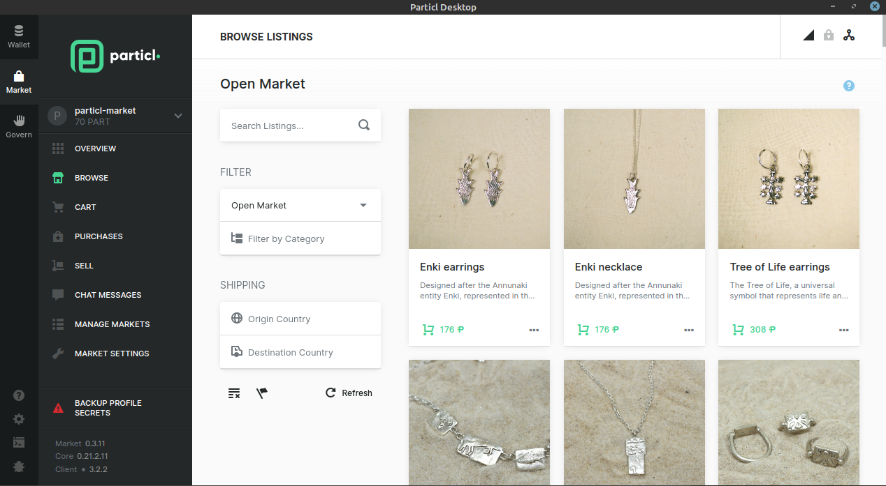

=========================
The Marketplace Explained
=========================

.. title::
   Particl Marketplace Explained

.. meta::
   :description lang=en: Learn more about Particl’s decentralized online marketplace and its digital online escrow.

Particl Marketplace is a peer-to-peer online marketplace - like eBay, but without middlemen, restrictions, invasive data mining practices, or even operating fees. It connects you directly with buyers and sellers from all around the world and lets you trade freely, without transaction or subscription fees, and in total privacy. It is Particl's first-ever privacy-first dApp and one of the only decentralized marketplace for physical goods and services in existence.

This Particl Academy page will explain, in detail, everything you need to know about it.

----

.. contents:: Table of Contents
   :local:
   :backlinks: none
   :depth: 2

----

What is it?
-----------

    Browse Particl Marketplace

:term:`Particl Marketplace`'s primary advantage compared to all other online marketplaces is that, for the first time in history, two parties who don't know each other can safely do e-commerce together without any middleman being involved and in complete and total privacy. Moreover, with it, you can bypass central parties such as payment processors, marketplace operators, banks, and legal institutions and only pay the bare minimum in terms of operating costs.

Benefits
~~~~~~~~

Particl's uniquely decentralized and peer-to-peer (P2P) architecture enables a wide variety of benefits and opportunities not possible on traditional online marketplaces such as eBay, Amazon, Alibaba, Etsy, and the likes.

* **Near-zero fees** — only pay the bare minimum for the network to run by itself and never pay middleman fees again.
* **Total privacy** — no data or personal information is ever generated or collected about you. You operate in complete anonymity.
* **Secure** — trustless encryption provides you with the highest level of digital security for your funds and sensitive information.
* **Absolute freedom** — censorship-proof e-commerce protocol with no predefined rules or policies and no item or category bans.
* **Unstoppable** — the network runs by itself across a global network of peers and requires no human intervention or maintenance.
* **Borderless** — enjoy the benefits and opportunities of an unrestricted, open global market with no financial borders.

Features
~~~~~~~~

The Particl Marketplace offers most of the features you’d expect to see on a traditional online marketplace but does so without the use of third parties. This preserves your privacy and can substantially reduce the total costs involved with doing business online.

.. container:: toggle

    .. container:: header

        **For Sellers**

    * **Sell anything** — Sell anything without restrictions.
    * **Open Market** — Sell on a global marketplace.
    * **Markets and storefronts** — Create your own personalized marketplace or shop to sell on.
    * **Inbox** — Safely communicate with buyers and potential customers using an end-to-end encrypted messaging system.
    * **Online escrow** — Give customers the confidence they need by securing trades with a two-party online escrow system.
    * **Private payments** — Receive anonymous payments that cannot be reversed (chargebacks) or frozen.
    * **Product imports** — Import your inventory from CSV files or from other platforms such as WooCommerce.

.. container:: toggle

    .. container:: header

        **For Buyers**

    * **Buy anything** — Buy anything without restrictions.
    * **Open Market** — Buy on a global marketplace.
    * **Markets and storefronts** — Shop from a wide variety of markets or seller shops.
    * **Inbox** — Safely communicate with sellers using an end-to-end encrypted messaging system.
    * **Online escrow** — Trade in full confidence with sellers you don’t know, using a two-party online escrow system.
    * **Private payments** — Send anonymous payments that preserve your financial privacy.

These benefits are only possible thanks to the uniquely :term:`decentralized <Decentralization>` nature of the :term:`Particl Marketplace`. 

----

Technicals in a Nutshell
------------------------

This historical feat is made possible thanks to a novel combination of bleeding edge technologies. It allows you to do e-commerce without middlemen, restrictions, or fees. This historical breakthrough in global commerce

:term:`Particl Marketplace` is a privacy-first decentralized application of the Particl ecosystem. It combines usage of the Particl Blockchain with the :term:`SecureMessaging <SecureMessaging (SMSG)>` P2P network (SMSG) to enable private payments, communications, security, and privacy capabilities that do not require human intervention or trust in a third-party. 

Particl Blockchain
~~~~~~~~~~~~~~~~~~

The :term:`Particl Blockchain` is a decentralized, immutable, and censorship-proof ledger that is privacy-oriented. It is built around the latest version of Bitcoin, but its code has been thoroughly enhanced by Particl contributors to provide a more robust level of privacy and more flexibility for use in decentralized applications like Particl Marketplace. 

The :term:`Particl Blockchain` validates and processes all financial transactions using its native and untraceable digital currency, PART. This disintermediates all transactions on the :term:`Particl Marketplace` — allowing for truly global and borderless payments — and makes them private by default.

The PART Coin
^^^^^^^^^^^^^

PART is the native :term:`cryptocurrency <Cryptocurrency>` of the :term:`Particl blockchain <Particl Blockchain>`. It is a privacy coin that, unlike other privacy-focused cryptocurrencies, retains a high level of flexibility and :term:`smart contract <smart contract>` compatibility. This allows PART to be used in various dApps like Particl Marketplace and grants them advanced privacy capabilities not possible otherwise. 

It uses several security, encryption, and privacy protocols that are open-source and can be freely reviewed by anyone. This ensures none of your personal information and data can be collected when transacting on the :term:`cryptocurrency <Particl Marketplace>`. Learn why it matters here. 

What does the blockchain do?
^^^^^^^^^^^^^^^^^^^^^^^^^^^^

The Particl Blockchain and its native privacy coin, PART, process all the financial-related activities of the marketplace’s users. 

* **Private transactions** — it processes transactions that are anonymous without involving any third-party (i.e., a payment processor).
* **Online escrow** — it enables two participants that do not know each other to protect their transactions using a two-party online escrow system.
* **User identity** — it provides users with identities that can be used to recognize users and build trust.
* **Content moderation** — it powers the marketplace’s moderation system by using coin balances as moderation power.

Every component of the Particl Marketplace is open-source, meaning that anyone can inspect the code and contribute to its development.

The SecureMessaging (SMSG protocol)
~~~~~~~~~~~~~~~~~~~~~~~~~~~~~~~~~~~

The :term:`SecureMessaging (SMSG)` network is Particl’s own custom-built and unique P2P messaging network that stands at the very core of its ecosystem. Inspired by the BitMessage protocol, the SMSG network is a mixnet that acts as a decentralized storage network (DSN). It stores and transfers data across :term:`nodes <node>` in a privacy-preserving manner, encrypted from end to end (E2EE), and without requiring the use of any central server.

SMSG processes all the non-financial data related to the marketplace — such as listing, order, and marketplace content information — and securely broadcasts it to the rest of the network in a peer-to-peer fashion and using strong end-to-end encryption. This avoids bloating the blockchain with excessive data and leaving permanent records.

What does SMSG do?
^^^^^^^^^^^^^^^^^^

SMSG is a key back-end component that makes Particl Marketplace and its groundbreaking benefits possible. It makes possible the following:

* **Listing information** — it stores and broadcasts listing information to the network.
* **Order information** — it processes orders and communicates trade data between two participants.
* **User communication** — it allows two participants to safely and privately communicate.
* **Content moderation** — it broadcasts the moderation preferences of each user to the rest of the network.

----

Access Gateways
---------------

Access gateways refer to any platform used by the end-user to access and use the Particl Marketplace. It is, in other words, the graphical interface of the application.

Because Particl Marketplace is, at its core, an open e-commerce protocol, it is possible to access and use it with a variety of access gateways. 

Gateways, each with pros and cons, may display things differently or provide a different set of features. But because they each connect to the same protocol, all gateways are cross-compatible with each other, meaning users do not need to be using the same gateway to trade with one another.
 
Particl Desktop
~~~~~~~~~~~~~~~

:term:`Particl Desktop` is Particl’s most popular desktop client. It lets you manage your Particl :term:`cryptocurrency` wallets, as well as use the marketplace through an easy-to-use and intuitive interface. It is currently the only available access gateway, with others in development.

If you want to buy or sell an item, browse its listings and markets, leave a comment, or just about do anything on the :term:`Particl Marketplace`, Particl Desktop is what you need.

.. container:: toggle

    .. container:: header

        **Pros**

    * **No compromise** — Use the marketplace in a completely peer-to-peer manner.
    * **Desktop access** — Access the marketplace locally from your computer.
    * **Maximum privacy** — Trade in complete and total privacy.

.. container:: toggle

    .. container:: header

        **Cons**

    * **Slower setup** — Particl Desktop’s setup process can take some time and tinkering.
    * **No web access** — The marketplace has to be accessed from a local client and cannot be used from the convenience of a web browser.
    * **Limited interoperability** — More difficult to connect third-party applications and services.

----

Mobile Application
~~~~~~~~~~~~~~~~~~

Although not available currently, a mobile application that lets you access and use the marketplace on the go is in the works. With mobile e-commerce rising steadily, this will massively improve the accessibility of the marketplace and open it up to new markets.

.. container:: toggle

    .. container:: header

        **Pros**

    * **On-the-go access** — Use the marketplace anywhere, anytime.
    * **Faster to set up** — Get started in just a few seconds thanks to a much quicker setup process.
    * **New markets** — Expands the marketplace’s audience by reaching mobile-dominant markets.

.. container:: toggle

    .. container:: header

        **Cons**

    * **Third-party nodes** — Third-party nodes slightly reduce the level of decentralization but still preserve your privacy using end-to-end encryption.
    * **Less resilient** — Mobile applications can be taken off app stores. iOS has no .apk alternative.

----

Web Gateway
~~~~~~~~~~~

Although not available presently, a web gateway that lets you access and use the marketplace from your favorite browser is in the works. 

With web applications taking an ever-increasing part of our digital lives, and with the vast majority of e-commerce platforms being available from the web, it is poised to become one of the most appealing access gateways for Particl Marketplace.

.. container:: toggle

    .. container:: header

        **Pros**

    * **Universal access** — Use the marketplace anywhere using your computer or mobile device.
    * **Faster to set up** — Get started in just a few seconds thanks to a much quicker setup process.
    * **Easy to use** — Using the marketplace from the web is the easiest and most user-friendly way to go about it.

.. container:: toggle

    .. container:: header

        **Cons**

    * **Third-party nodes** — Third-party nodes slightly reduce the level of decentralization but still preserve your privacy using end-to-end encryption.
    * **Phishing** — By nature, web applications tend to be more prone to successful phishing and social engineering attacks.

----

Third-Party Integrations
~~~~~~~~~~~~~~~~~~~~~~~~

The Particl Marketplace can communicate with outside applications, enabling integrations in third-party products and services like :term:`cryptocurrency` wallets, payment applications, web plugins (i.e., WooCommerce), etc.

But although this functionality is already available, a comprehensive developer SDK toolkit along with developer-friendly modules are in the works to make the process of integrating the marketplace into third-party applications easier and more straightforward. 

.. container:: toggle

    .. container:: header

        **Pros**

    * **Use-case improvement** — Add functionality and use-cases to your product by integrating the ready-made Particl Marketplace
    * **Varied access** — Access and use the marketplace from other non-Particl applications that you may already use
    * **All the benefits of web access** — Integrating the marketplace into a third-party application can enable all the benefits of web gateways

.. container:: toggle

    .. container:: header

        **Cons**

    * **Third-party nodes** — Third-party nodes slightly reduce the level of decentralization
    * **Privacy risks** — A third-party may not hold the same privacy ethos as the Particl project and work on collecting data or tracking its users
    * **Implementation risks** — Requires that you trust the third-party and its implementation of the Particl Marketplace.

----

.. seealso::

 - Marketplace Guides - :doc:`Install and Get Started <../marketplace-guides/marketguides_installation>`
 - Marketplace Guides - :doc:`Sell Stuff <../marketplace-guides/marketguides_sell>`
 - Marketplace Guides - :doc:`Buy Stuff <../marketplace-guides/marketguides_buy>`
 - Particl Wiki - `Open Market Protocol <https://particl.wiki/learn/marketplace/open-market-protocol/>`_
 - Particl Wiki - `SecureMessaging <https://particl.wiki/learn/marketplace/smsg/>`_
 - Github - `Particl Desktop <https://github.com/particl/particl-desktop>`_
 - Github - `Particl Core <https://github.com/particl/particl-core>`_
 - Unofficial Gateway - `Particl Store <https://particl.store/>`_
 - Unofficial Gateway - `Particl Marketplace Shop <http://particlmarketplace.shop/>`_
 - Marketplace Explained - :doc:`Two Party Escrow System <../particl-marketplace/marketplace_escrow>`
 - Marketplace Explained - :doc:`Privacy Specifications <../particl-marketplace/marketplace_privacy>`